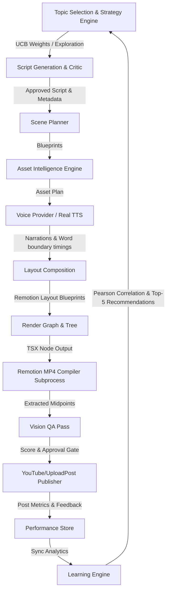

# ClipPilot

*A native Windows/macOS app where **Claude is the brain** that turns long-form video into short-form income — honestly, legally, and with you in the loop.*

ClipPilot watches your videos like a human, picks the clip-worthy moments and explains why, cuts and **captions** vertical shorts, writes the titles/hashtags, and lines them up for **your one-click approval** before publishing — to YouTube, for free. It runs **CPU-only on your machine**; FFmpeg is bundled.

---

## 🏗️ Architecture Diagram



---

## ⚙️ Centralized Configuration Guide

All provider settings, model names, paths, feature flags, rendering options, and runtime defaults live in a unified settings and environment layer.

### Settings File (`settings.json`)
The configuration is saved in the data directory (`ClipPilot/data/settings.json`) or custom data path. Refer to [settings.example.json](settings.example.json) for fields:
*   `auto_approve`: Skip human review gate (default `false`).
*   `max_attempts`: Per-stage retry budget (default `3`).
*   `default_section`: Active execution section (`A`, `B`, or `C`).
*   `brain_model` / `llm_model`: The model used for LLM operations.
*   `llm_provider`: Selected provider (`anthropic`, `openai`, or `openrouter`).
*   `llm_api_key`: Optional explicit provider API Key.
*   `bgm_volume`: Audio level balance for backing tracks (0.0 to 1.0).

### Environment Variables Overrides
Any setting in `settings.json` can be overridden at runtime by exporting its name in uppercase (with or without `CLIPPILOT_` prefix).
Examples:
*   `CLIPPILOT_LLM_PROVIDER=openai`
*   `CLIPPILOT_LLM_MODEL=gpt-4`
*   `BGM_VOLUME=0.15`

---

## 🔑 Secrets Management & Provider Setup

We support major AI and publishing platform credentials. Copy `.env.example` to `.env` to configure:

1.  **Anthropic Setup**: Add `ANTHROPIC_API_KEY=your_key` for Claude vision and script evaluation.
2.  **OpenAI Setup**: Add `OPENAI_API_KEY=your_key` to use GPT-4 as the rendering brain.
3.  **OpenRouter Setup**: Add `OPENROUTER_API_KEY=your_key` for alternative open-weights models.
4.  **YouTube OAuth Setup**:
    *   Create a Google Cloud Console Project.
    *   Enable the YouTube Data API v3.
    *   Create an OAuth Client ID (Select **Desktop App**).
    *   Set `YOUTUBE_CLIENT_ID` and `YOUTUBE_CLIENT_SECRET` in `.env`.
    *   Obtain a refresh token using `python -m clippilot.publish.youtube_auth --write-env`.

---

## 🛠️ CLI Reference

ClipPilot provides a unified CLI entry point instead of running individual files.

### Commands

*   `clippilot run`: Execute the E2E production pipeline.
    ```bash
    clippilot run --workspace . --variation variation --date 2026-07-03 --slug daily_006
    ```
    *   *Legacy flag*: Pass `--legacy` to drain the Stage 0 clipping queue instead of running the production pipeline.
*   `clippilot render`: Compile and render the Remotion video composition only (skips QA & Upload).
    ```bash
    clippilot render --workspace . --slug daily_006
    ```
*   `clippilot learn`: Run the Learning Engine to analyze historical video performance logs.
    ```bash
    clippilot learn --workspace .
    ```
*   `clippilot analytics`: Retrieve real statistics for published videos and update local records.
    ```bash
    clippilot analytics --workspace .
    ```
*   `clippilot strategy`: Output the next Strategy Engine decision configuration.
    ```bash
    clippilot strategy --workspace . --variation variation
    ```
*   `clippilot history`: Print a summary of recorded VideoPerformance history.
    ```bash
    clippilot history --workspace .
    ```
*   `clippilot doctor`: Perform diagnostics on system dependencies and keys.
    ```bash
    clippilot doctor
    ```
*   `clippilot config`: Read or write configuration options.
    ```bash
    clippilot config list
    clippilot config get --key max_attempts
    clippilot config set --key max_attempts --value 5
    ```

---

## 🩺 System Diagnostics (Doctor Command)

Run `clippilot doctor` to inspect and output a report on your workspace environment:
*   **Python Version**: Verifies >= 3.8 capability.
*   **FFmpeg**: Checks if imageio-ffmpeg or system FFmpeg is functional.
*   **Node & npm**: Confirms Node ecosystem presence.
*   **Remotion**: Audits package setup in `ClipPilot/remotion_explainer`.
*   **Edge TTS**: Checks the speech generation library.
*   **Public Assets / Out Dir**: Verifies required folders exist.
*   **Configuration File**: Validates `settings.json` format and values.

---

## 📖 Installation & Developer Guide

### Installation
1.  Clone the repository.
2.  Install dependencies:
    ```bash
    pip install -e .
    ```
    *(Or `pip install -r src/requirements.txt` for development).*
3.  Set up environment file:
    ```bash
    cp .env.example .env
    ```
4.  Run diagnostics:
    ```bash
    clippilot doctor
    ```

### Running Tests
To run all tests in isolation:
```bash
PYTHONPATH=ClipPilot/src python3 -m unittest discover -s ClipPilot/src/tests
```

---

## 🔍 Troubleshooting Guide

*   **Remotion rendering fails with Command Not Found**:
    Run `cd ClipPilot/remotion_explainer && npm install` to download dependencies.
*   **FFmpeg executable not found**:
    Reinstall static wrapper: `pip install --force-reinstall imageio-ffmpeg`.
*   **Configuration ValueError during run**:
    Run `clippilot config list` to check key formats and types. Fix invalid options using `clippilot config set`.
*   **Structured Logging Verbosity**:
    Export `CLIPPILOT_LOG_LEVEL=DEBUG` or `CLIPPILOT_FILE_LOGGING=true` to capture complete debugger outputs.
